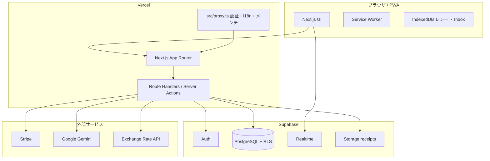

# SpliTrip（スプリトリップ）

**グループ旅行の割り勘を、記録から精算までひとつに。**

| | |
|---|---|
| **デモ** | [https://splitrip.net](https://splitrip.net) |
| **リポジトリ** | [github.com/Niboshi-Wasabi/SpliTrip](https://github.com/Niboshi-Wasabi/SpliTrip) |
| **種別** | 個人開発 / フルスタック Web アプリ（PWA） |
| **スタック** | Next.js 16 · React 19 · TypeScript · Supabase · Stripe |

> **English:** A progressive web app for group travel expense splitting — shared ledgers, receipt OCR, and debt-simplification settlements with fewer transfers.

---

## このプロジェクトについて

SpliTrip は、**複数人での旅行・飲み会などの立替精算**を想定した Web アプリです。出費の入力・按分・可視化に加え、**送金回数を最小化する精算プラン**の提示、**送金先リンクとの連携**までを一つのプロダクトにまとめています。

転職活動のポートフォリオとして、**要件定義から設計・実装・本番運用**まで一通り経験した個人開発プロジェクトです。

### 解決している課題

- 旅行中に立替が増えると、誰がいくら払ったか・誰がいくら負担すべきかが曖昧になる
- 精算時に「A→B→C…」と送金が増え、手間とミスが発生する
- レシートや外貨での支払いをあとから振り返りにくい

### アプローチ

- **グループ単位の共有台帳**でリアルタイムに同期
- **グリーディアルゴリズム**で送金回数を削減した精算プランを自動生成
- **日本向け UX**（日本語/英語、PayPay・LINE Pay 連携、モバイルファースト）
- **Supabase RLS** によるマルチテナント的なデータ分離

---

## 主な機能（ユーザー向け）

| 領域 | 内容 |
|------|------|
| **認証** | Google（OAuth / PKCE）、LINE、メール/パスワード |
| **グループ** | 作成・招待（URL / QR）・参加・仮メンバー・閲覧専用共有 |
| **出費** | 均等 / 金額指定 / シェア / パーセント / 品目別、端数ポリシー、カテゴリ |
| **レシート** | 撮影→ローカル Inbox、Gemini OCR（金額・日付の候補入力） |
| **精算** | 最小送金プラン、送金済みマークの永続化、PayPal / Cash App / PayPay / LINE Pay |
| **可視化** | ダッシュボード、カテゴリ別・グループ別グラフ（Recharts） |
| **運用基盤** | メンテナンスモード、システムステータスページ、管理画面 |
| **国際化** | 日本語 / 英語（next-intl） |

詳細は [`docs/FEATURES.md`](docs/FEATURES.md) を参照してください。

---

## 技術的な見どころ（採用担当・エンジニア向け）

実装の深さを確認したい方は、次のドキュメントも参照してください。

- **[アーキテクチャ概要](docs/ARCHITECTURE.md)** — レイヤ構成、認証、データフロー
- **[DB スキーマ](docs/DATABASE_TABLES.md)** — テーブル定義・RLS
- **[機能・API 一覧](docs/FEATURES.md)** — エンドポイント・運用メモ

### ハイライト

1. **フルスタック TypeScript**  
   App Router の Server / Client Components、Route Handlers、Server Actions を用途に応じて使い分け。

2. **Supabase を中核にした BaaS 設計**  
   Postgres + RLS、Auth（Google / LINE）、Storage（領収書）、Realtime（共同編集時の更新通知）。

3. **精算ロジックの自前実装**  
   ネット残差からの債務簡約（`simplify-debts`）と、送金済み状態の `settlement_transactions` テーブルでの永続化。

4. **国際化・セキュリティ**  
   `next-intl` による型安全な i18n、Turnstile、WebAuthn（2FA 基盤）、API エラーの情報漏洩抑制、CI セキュリティスキャン。

5. **本番運用を意識した構成**  
   カスタムドメイン、Stripe Webhook 冪等処理、GitHub Actions によるヘルスプローブ、メンテナンス・告知の DB 駆動。

### アーキテクチャ（概要）



### 品質・テスト

| 項目 | 内容 |
|------|------|
| **単体テスト** | Jest（精算ロジック、スプリット計算など） |
| **CI** | GitHub Actions — セキュリティパターンスキャン（`security-scan.yml`） |
| **Lint** | ESLint（Next.js 設定） |

```bash
npm run test
npm run security:scan
```

---

## 技術スタック

| 領域 | 技術 |
|------|------|
| フロントエンド | Next.js 16（App Router）、React 19、TypeScript、Tailwind CSS v4 |
| UI | HeroUI / shadcn 系、Recharts、Framer Motion、Lucide |
| バックエンド | Supabase（Postgres、Auth、RLS、Storage、Realtime） |
| 認証 | Google OAuth（PKCE）、LINE、メール/パスワード、WebAuthn（基盤） |
| i18n | next-intl（ja / en） |
| 決済 | Stripe（Checkout / Webhook、PRO プラン基盤） |
| AI | Google Gemini（レシート OCR） |
| ホスティング | Vercel、Cloudflare DNS |
| DB マイグレーション | Supabase CLI（`supabase/migrations`） |

---

## クイックスタート（開発者向け）

### 前提

- Node.js 20+
- npm
- Supabase プロジェクト（または [ローカル Supabase](#ローカル-supabase)）

### セットアップ

```bash
git clone https://github.com/Niboshi-Wasabi/SpliTrip.git
cd SpliTrip
npm install
```

ルートに `.env.local` を作成し、最低限次を設定します。

| 変数 | 用途 |
|------|------|
| `NEXT_PUBLIC_SUPABASE_URL` | Supabase プロジェクト URL |
| `NEXT_PUBLIC_SUPABASE_ANON_KEY` | 匿名キー |
| `SUPABASE_SERVICE_ROLE_KEY` | サーバー専用（Webhook 等） |
| `NEXT_PUBLIC_SITE_URL` | OAuth リダイレクト用（例: `http://localhost:3000`） |

Google / LINE ログイン、Stripe、Gemini を使う場合は [`docs/FEATURES.md`](docs/FEATURES.md) の環境変数一覧を参照してください。

```bash
npm run dev      # http://localhost:3000
npm run build
npm run test
```

### DB マイグレーション

```bash
npm run db:login    # 初回のみ
npm run db:push:all # リモート Supabase へ反映
```

### ローカル Supabase

Docker 上で本番と分離した DB を使う場合:

```bash
npm run db:local:start
npm run db:local:status   # URL / キーを表示
npm run dev
```

---

## リポジトリ構成

```
src/
  app/           # App Router（ページ・API Route）
  components/    # UI コンポーネント
  lib/           # ドメインロジック（精算・按分・i18n 等）
  hooks/         # SWR + Realtime 連携
supabase/
  migrations/    # SQL マイグレーション（RLS 含む）
messages/        # i18n 辞書（ja.json / en.json）
docs/            # 機能一覧・DB・アーキテクチャ
```

---

## ドキュメント

| ドキュメント | 内容 |
|-------------|------|
| [`docs/ARCHITECTURE.md`](docs/ARCHITECTURE.md) | アーキテクチャ・設計判断（ポートフォリオ向け） |
| [`docs/PORTFOLIO.md`](docs/PORTFOLIO.md) | 面接・ピッチ用メモ |
| [`docs/FEATURES.md`](docs/FEATURES.md) | 機能・API・運用の詳細 |
| [`docs/DATABASE_TABLES.md`](docs/DATABASE_TABLES.md) | データベース表定義 |
| [`requirements.md`](requirements.md) | 初期要件メモ（履歴） |

---

## 本番・デプロイ

- **本番 URL:** [https://splitrip.net](https://splitrip.net)
- **ホスティング:** Vercel
- **ヘルスチェック:** `GET /api/health`
- **デプロイ手順・環境変数の詳細:** [`docs/FEATURES.md`](docs/FEATURES.md) の「本番 URL・カスタムドメイン」

---

## 作者について

<!-- 転職活動用: 以下をご自身の情報に差し替えてください -->

| 項目 | 内容 |
|------|------|
| **開発** | 個人開発（要件定義〜本番運用） |
| **GitHub** | [@Niboshi-Wasabi](https://github.com/Niboshi-Wasabi) |
| **連絡先** | （メール・LinkedIn・Wantedly 等を追記） |

---

## ライセンス

本リポジトリは `package.json` で `"private": true` です。コードの再利用・公開範囲は作者の判断に従います。
