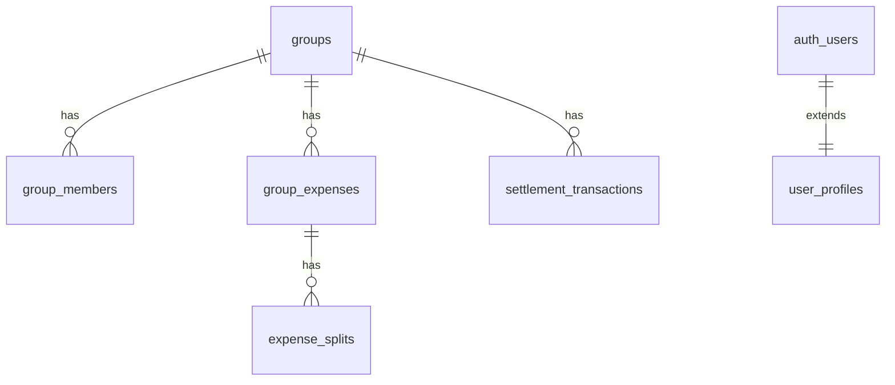

# SpliTrip — アーキテクチャ概要

採用担当・技術面接向けに、システム構成と主要な設計判断をまとめたドキュメントです。  
実装の詳細は [`FEATURES.md`](FEATURES.md) と [`DATABASE_TABLES.md`](DATABASE_TABLES.md) を参照してください。

---

## 1. システムコンテキスト

| 項目 | 内容 |
|------|------|
| **プロダクト** | グループ旅行などの割り勘・精算 PWA |
| **ユーザー** | 旅行参加者（一般ユーザー）、運営管理者 |
| **本番** | Vercel + Supabase + Cloudflare DNS（`splitrip.net`） |

---

## 2. レイヤ構成

```
[Presentation]  src/app/**, src/components/**
       ↓
[Application]   Route Handlers, Server Actions, src/proxy.ts
       ↓
[Domain]        src/lib/**  (精算・按分・為替・i18n 等)
       ↓
[Infrastructure] Supabase Client / SSR, Stripe SDK, Gemini API
       ↓
[Data]          PostgreSQL (RLS), Storage, Realtime
```

### フロントエンド

- **Next.js App Router** — 認証後画面は Server Component でデータ取得、インタラクティブ部分は Client Component
- **SWR + Supabase Realtime** — グループ画面のキャッシュと他メンバー更新の反映
- **PWA** — `manifest.webmanifest`、Service Worker、レシート Inbox は IndexedDB（`idb`）

### バックエンド

- **Route Handlers** (`src/app/api/**`) — REST 風 API、Webhook（Stripe）
- **Server Actions** — レシート OCR などサーバー処理が必要なフォーム連携
- **RPC / マイグレーション** — `insert_expense_with_splits` 等、トランザクション境界を DB 側で保証

### エッジ / プロキシ

- **`src/proxy.ts`** — セッション更新、ロケール、`/dashboard` ガード、メンテナンスリダイレクト  
  （Next.js 16 の `middleware` 相当エントリ）

---

## 3. 認証フロー

| プロバイダ | フロー概要 |
|-----------|-----------|
| **Google** | OAuth PKCE → `/auth/callback` → Supabase セッション |
| **LINE** | `/api/auth/line` → LINE 認可 → `/api/auth/callback/line` → `signInWithIdToken` |
| **メール** | Supabase Auth（サインアップ / ログイン / パスワードリセット） |

セッションは `@supabase/ssr` の Cookie ベース。ログイン後 `user_profiles` を upsert し、表示名・言語・送金先をアプリ側で管理します。

---

## 4. ドメインモデル（コア）



| 概念 | 説明 |
|------|------|
| **Group** | 旅行単位の割り勘グループ（通貨コード、招待トークン、精算完了フラグ） |
| **Expense** | 立替記録。`split_type` + `expense_splits` で按分 |
| **Settlement** | 計算上の「A → B へ X 円」。`settlement_transactions` で送金済みを永続化 |
| **Profile** | 表示名、送金先（PayPal / PayPay 等）、PRO フラグ |

### 精算アルゴリズム

1. 各メンバーの **ネット残差**（支払総額 − 負担総額）を計算
2. **グリーディマッチング**で債権者・債務者を突き合わせ、送金回数を最小化（`src/lib/simplify-debts.ts`）
3. UI で送金リンク表示 + 債務者が「送金済み」をマーク → DB 保存

按分ロジック（均等・金額指定・シェア・パーセント・品目別）は `src/utils/settlement.ts` に集約し、Jest でテストしています。

---

## 5. セキュリティ設計

| 観点 | 実装 |
|------|------|
| **認可** | Supabase RLS — グループメンバーのみ `group_expenses` 等を参照・更新 |
| **API** | 500 エラーは汎用メッセージのみ（内部エラーをクライアントに返さない） |
| **入力** | 按分・金額はサーバー側で再検証。SQL はパラメータ化 / RPC のみ |
| **課金** | Stripe Webhook 署名検証 + `stripe_webhook_events` で冪等処理 |
| **ボット対策** | Cloudflare Turnstile（ログイン・招待ゲート） |
| **CI** | `npm run security:scan` — 危険パターンの静的検出 |

---

## 6. 国際化（i18n）

- **next-intl** — `messages/ja.json`, `messages/en.json`
- **ルーティング** — `localePrefix: as-needed`、既定 `ja`
- **初回言語** — `Accept-Language` + デバイス言語 Cookie
- **ログイン後** — `user_profiles.preferred_language` で上書き

UI 文言のハードコードは禁止し、辞書キー経由で統一しています。

---

## 7. 運用・観測

| 機能 | 実装 |
|------|------|
| **メンテナンス** | 環境変数 + `maintenance_schedules` テーブル |
| **ステータスページ** | `system_status` + 定期プローブ（GitHub Actions cron） |
| **管理画面** | `is_admin` ユーザー向け `/admin`（監査ログ付き） |
| **分析** | Vercel Analytics / Speed Insights |

---

## 8. 今後の拡張余地（参考）

- Web Push 通知（API プレースホルダーあり）
- オフライン出費キュー（レシート Inbox は実装済み）
- PRO 課金 UI の再開（Stripe 基盤は維持）

---

## 9. 関連ファイル（読む順の目安）

1. `src/lib/simplify-debts.ts` — 精算コア
2. `src/lib/group-queries.ts` — グループ詳細の取得と精算マージ
3. `src/proxy.ts` — リクエスト前処理
4. `supabase/migrations/` — スキーマ・RLS の単一の真実
